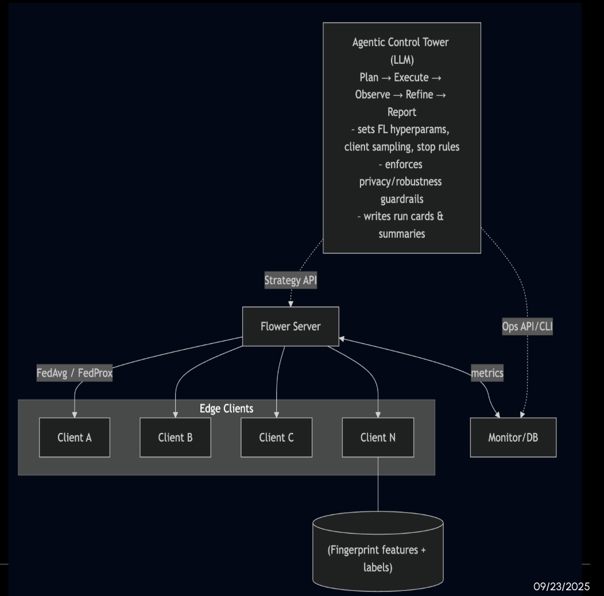
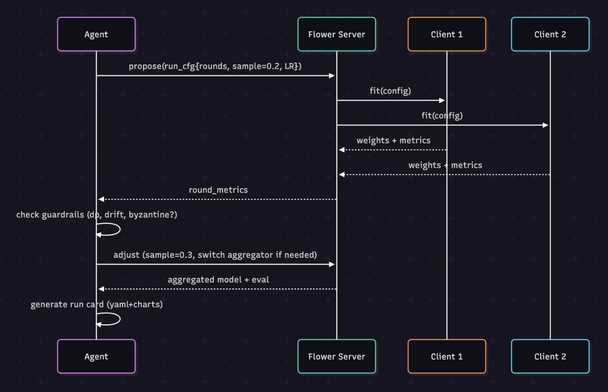

# AICONTROLLER – LLM-powered Federated Learning Controller (Flower + Mongo + Ollama)

Run, track, and iterate on federated learning (FL) experiments **from a single terminal**.

- **Flower** powers the server/client runtime.
- **MongoDB** stores runs/rounds/metrics.
- A lightweight **LLM agent** (via **Ollama**) turns natural language into actions like  
  `run 3 rounds with FedAdam (lr 0.005, local-epochs 2, fraction-train 0.6)`  
  and suggests the **next** configuration based on results.

---




## Why this exists

Federated experiments involve lots of knobs (strategy, rounds, epochs, lr, sampling…). Keeping track of runs and quickly doing the “next sensible thing” is tedious. This project:

1. **Orchestrates** Flower runs from natural language.
2. **Logs** everything to Mongo (`runs`, `rounds`) with robust metric capture.
3. **Suggests next** configs based on recent outcomes, so you can iterate faster.

---

## Repo structure

```
aicontroller/
  aicontroller/
    __init__.py
    agent_runner.py
    client_app.py          # dataset/model/training (SOCOFing demo task)
    llm_agent_cli.py       # the terminal agent (entrypoint you run)
    server_app.py          # Flower ServerApp entrypoint
    tracking_strategy.py   # strategy wrapper -> unified hooks + Mongo logging
  data/                    # put dataset under here (see below)
  pyproject.toml
  README.md
```

---

## Requirements

- **Python** 3.9+ (tested on 3.9)
- **Flower** (>= 1.22 recommended)
- **MongoDB** running locally (or set `MONGODB_URI`)
- **Ollama** with a small chat model available (defaults to `llama3.2:3b`)
- **PyTorch** (CPU is fine)
- **SOCOFing** dataset (for the included demo task)

> You can switch the Ollama model name in `llm_agent_cli.py` if you prefer another local model.

---

## Installation

```bash
# 1) Clone and enter
git clone <YOUR_REPO_URL> FlowerHackathon
cd FlowerHackathon/aicontroller

# 2) Create env and install
python -m venv env
source env/bin/activate
python -m pip install -U pip
pip install -e .

# 3) Optional quick checks
flwr --version
python -c "import pymongo; print('pymongo ok')"
# If you want to sanity-check Ollama:
# ollama pull llama3.2:3b
# ollama run llama3.2:3b -p "Say ready."
```

---

## Dataset layout (SOCOFing)

Place the dataset under `data/SOCOFing` **or** set `AIC_DATA_ROOT` (see env vars).

Expected layout:

```
data/
  SOCOFing/
    Real/...
    Altered/
      Altered-Easy/...
      Altered-Medium/...
      Altered-Hard/...
```

If the scanner prints **“found 0 images”**, your path is wrong or the layout doesn’t match.

---

## Environment variables

Most have sensible defaults, but you can override:

| Var | What it does | Default |
| --- | --- | --- |
| `MONGODB_URI` | Mongo connection | `mongodb://localhost:27017` |
| `MONGODB_DB` | Database name | `flwr_runs` |
| `OLLAMA_HOST` | Ollama base URL | `http://localhost:11434` |
| `AIC_DATA_ROOT` | Dataset root | `<repo>/data` (hardcoded in script in your user path) |
| `AIC_LABEL_MODE` | `binary` or `fourclass` | `binary` |
| `AIC_NUM_PARTITIONS` | Num of client partitions | `5` |
| `AIC_AGENT_LOG_LEVEL` | Agent logging | `INFO` |
| `AIC_AGENT_MONGO_LOCK_ENABLE` | Avoid overlapping runs | `true` |

**Logs** are written to `~/.cache/aicontroller/llm_agent.log` and a JSONL event stream.

---

## Run the agent

From the project root (where `pyproject.toml` lives):

```bash
source env/bin/activate
python -m aicontroller.llm_agent_cli
# or
python aicontroller/llm_agent_cli.py
```

You’ll see a prompt like:

```
agent> 
```

---

## What you can type (local commands)

These **do not** involve the LLM and are guaranteed to work deterministically:

- `status` – shows whether a run is in progress.
- `tool list` – prints available tools.
- `list` or `list runs` – table of recent runs from Mongo.
- `unlock` – clears a stuck run-lock if a previous run crashed.
- **Run shortcut**  
  ```
  run 1 rounds with FedAvg (lr 0.01, local-epochs 2, fraction-train 0.6)
  ```
  The agent converts it into `flwr run . --run-config ...` for you.
- **Show round details**
  ```
  show rounds <RUN_OBJECT_ID>
  ```
- **Summaries**
  ```
  summarize latest
  summarize <RUN_OBJECT_ID>
  ```
- **Suggestions**
  ```
  suggest next
  suggest <RUN_OBJECT_ID>
  ```
- **Compare strategies**
  ```
  compare strategies FedAvg, FedAdam (limit 20)
  ```

> You can still chat in natural language; the agent will try to interpret and route to a tool. The local commands above are the fastest path during demos.

---

## Tools (what the agent can do)

The agent exposes a small toolbelt; each tool is also wired to a local command.

| Tool name | Purpose | Inputs | Output (shown as rich tables/panels) |
| --- | --- | --- | --- |
| `run_flower` | Launch Flower with a config | `num-server-rounds`, `local-epochs`, `fraction-train`, `lr`, `strategy`, `data-root`, `label-mode`, `num-partitions` | Starts run; prints launch status |
| `list_runs` | List recent runs from Mongo | `limit`, `strategy` (optional filter) | Table with Run ID, strategy, timestamps, status |
| `show_rounds` | Per-round metrics for a run | `run_id` | Table with round/phase/eval acc/avg train loss |
| `summarize_run` | Compact summary | `run_id` or `latest=true` | Panel with best acc, last train loss, tips |
| `suggest_next` | Suggest a next run config | `run_id` or `latest=true` | Strategy/rounds/epochs/lr proposal with rationale |
| `compare_strategies` | Quick leaderboard by strategy | `strategies[]`, `limit` | Grouped tables with best/last acc, loss, hyperparams |

---

## How it works (architecture)

1. **LLM Agent (`llm_agent_cli.py`)**
   - Talks to Ollama for natural language.
   - Parses your commands or the LLM’s JSON and dispatches **tools**.
   - Enforces a **run lock** to prevent overlapping runs.
   - Shows results cleanly (no raw JSON).

2. **ServerApp (`server_app.py`) + `TrackingStrategy`**
   - Wraps the Flower strategy to normalize `aggregate_*` signatures across versions.
   - Logs **runs** and **rounds** to Mongo (including client metrics when available).
   - Marks runs `running → completed/failed` reliably.

3. **ClientApp (`client_app.py`)**
   - Implements the demo **SOCOFing** task:
     - Small CNN (grayscale, 96×96).
     - IID partitioning, 80/20 split per partition.
     - `label-mode`: `binary` (Real vs Altered) or `fourclass` (alteration type).

---

## Quick demo script (copy/paste)

```text
# 1) Start the agent
python -m aicontroller.llm_agent_cli

# 2) Launch a short run
agent> run 1 rounds with FedAvg (lr 0.01, local-epochs 1, fraction-train 0.6)

# 3) Watch status and list runs
agent> status
agent> list

# 4) Summarize and inspect
agent> summarize latest
# copy a Run ID from the list:
agent> show rounds 68d73981da6ed952028f442e

# 5) Get a next-step proposal
agent> suggest next

# 6) Try a different strategy
agent> run 1 rounds with FedAdam (lr 0.01, local-epochs 1, fraction-train 0.6)

# 7) Compare strategies
agent> compare strategies FedAvg, FedAdam (limit 10)
```

---

## Direct Flower usage (optional)

You can bypass the agent and invoke Flower yourself:

```bash
flwr run . --run-config 'num-server-rounds=3 local-epochs=2 fraction-train=0.6 lr=0.01 strategy="FedAvg" data-root="/ABS/PATH/TO/data" label-mode="binary" num-partitions=5'
```

---

## Troubleshooting

- **“found 0 images”**  
  Fix your dataset path/layout. Check `AIC_DATA_ROOT` and ensure `data/SOCOFing/...` exists as shown above.

- **Show/Suggest “does nothing”**  
  Use the **local** forms (`show rounds <id>`, `suggest next`) which bypass the LLM.

- **“run lock present”** after a crash  
  Run `unlock` at the prompt.

- **Mongo not updating**  
  Ensure Mongo is reachable (`MONGODB_URI`). Collections used: `runs`, `rounds`.

- **Ollama errors**  
  Start Ollama and pull a model (`ollama pull llama3.2:3b`) or update the model name passed to the agent (`--model` flag in `chat` command).

- **Flower aggregate_* signature errors**  
  The included `tracking_strategy.py` handles multiple signatures. If you see version-mismatch issues, upgrade Flower and reinstall this package: `pip install -e .`

---

## Notes & Credits

- Built for the Flower Hackathon; uses the excellent Flower FL framework.
- Demo task adapted to the **SOCOFing** fingerprint dataset.
- Local LLM orchestration via **Ollama**.
